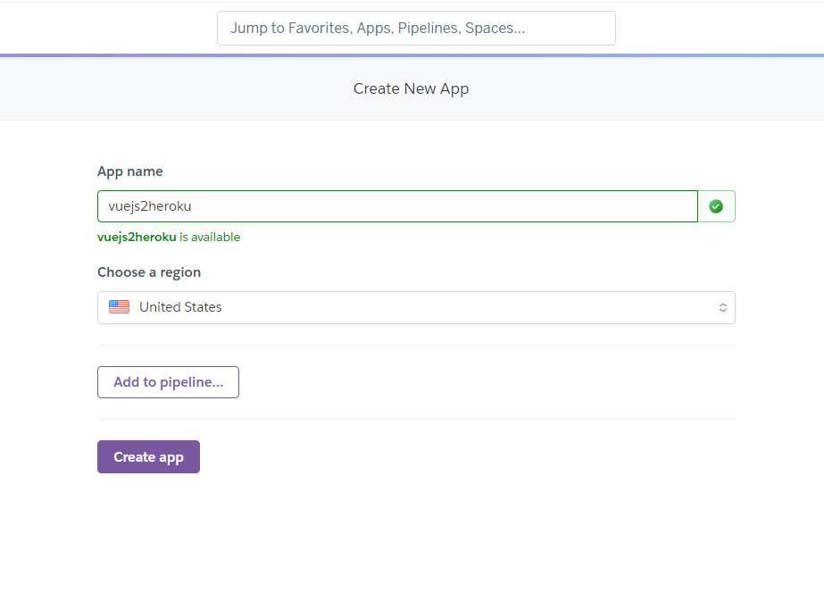
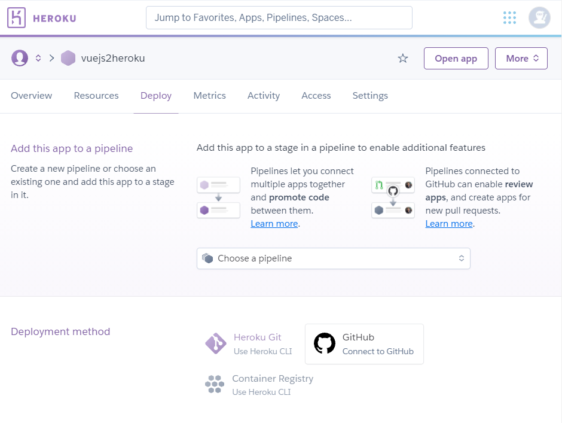
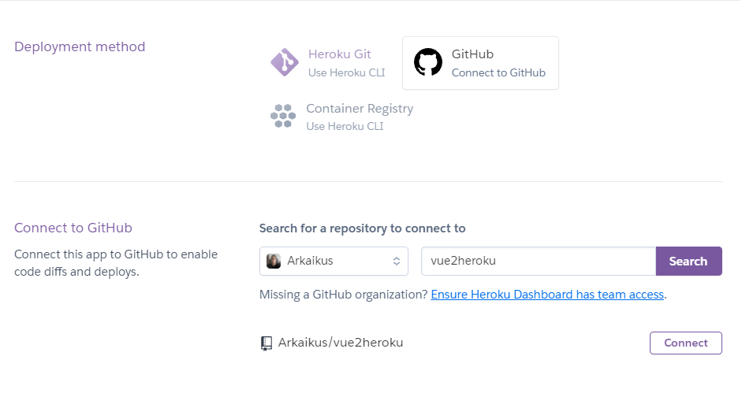
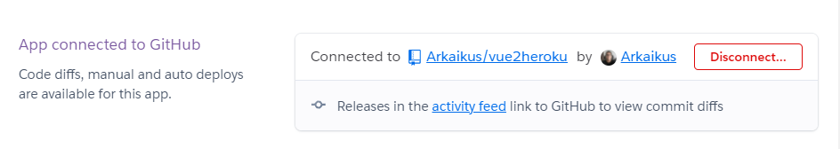
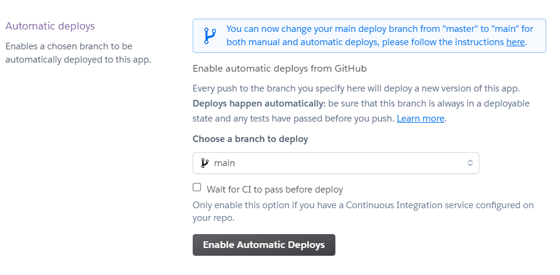
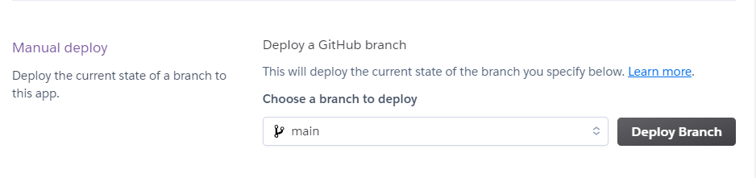

# Vue2Heroku Example

## Repo Setup

- If vuejs app is in current folder then add engine and start commands

```json
{
    ...
    "engines": {
        "node": "14.x"
    },
    ...
    "scripts": {
        ...
        "start": "npm run serve",
        ...
    },
    ...
}
```
- If vuejs app is in some folder like frontend then run `npm init` to generate `package.json` and add


```json
{
    ...
    "engines": {
        "node": "14.x"
    },
    ...
    "scripts": {
        ...
        "start": "cd frontend && npm run serve",
        ...
    },
    ...
}
```

- Create `Procfile` and add `web: npm start`

## Herkou Setup

- Sign in to heroku
> 
- Create an app
> 
- Connect to github repo
> 
- Search repo and connect
> 
> 
- Enable automatic deploy
> 
- Or deploy manually
> 